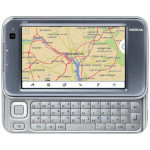

# Nokia N810

  
|Component|Description                      |
|---------|---------------------------------|
|CPU      |TI OMAP2420 400MHz               |
|RAM      |128MB                            |
|Storage  |2GB                              |
|Screen   |4.13" 800x480 Resistive Touch    |
|Slot     |MicroSD                          |
|Keyboard |4 Rows QWERTY                    |
|USB      |Host and Client                  |
|Bluetooth|v2.0 + EDR                       |
|WLAN     |Wi-Fi 802.11 b/g                 |
|Battery  |3.7V 1500mA                      |
|Dimension|128mm x 72mm x 14mm              |
|Weight   |226g                             |

### https://steward-fu.github.io/website/index.htm
